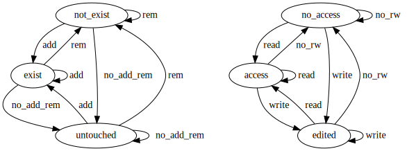

# XPMA CASE

*CASE done right!*

Computer Aided Software Engineering tool implementing the *XPM combined model*. XPM ties together BPMN 2.0 (process modeling) and CSDDM 1.0 (data modeling) and provides additional convenient read-only views of the resulting model (e.g. Entity Relationship Diagram, Use Case Diagram). XPMA CASE produces input for [XPMA](https://github.com/dumblob/XPMA).

## Complex System Data Definition Model 1.0

CSDDM 1.0 is a new model of a data schema allowing formally, throughly, but still concisely describe semistructured data with properties from the top-most abstraction level - from user interface. It is designed with coupling with process modeling in mind.

The main goal of CSDDM is to define firm detailed boundaries for implementation of complex systems. These are nowadays implementation-technology-dependent and thus a data model implemented in two different technologies results in totally different solutions, often strongly compromising the outcome quality, because the decision of settings of many properties is left to implementators who have no overview of the whole system and are strongly led astray by significant limitations of the chosen implementation technology - imagine Java, SQL, etc.

The model is structured as a **tree of items** (nodes and leafs), whereas each item has it's own set of **properties**. The model is depicted in a form of a table for better understandability. Table depiction is also the recommended one.

*Data model for a task T1 of a process P1*

kind | nest | id | perm | uniq | constr | init | sync | consis | quant | impo
---  | ---  | ---| ---  | ---  | ---    | ---  | ---  | ---    | ---   | ---
c | 0 | collection00 | add_rem | - | - | - | hardlink | write | 0 | medium
a | 1 |     attr00 | no_rw | none | string_ascii_printable | "" | hardlink | write | 0 | medium
a | 1 |     attr01 | write | none | int64 | 0 | hardlink | write | 0 | medium
c | 1 |     collection00 | add_rem | - | - | - | hardlink | write | 0 | medium
c | 0 | collection01 | add | - | - | - | hardlink | write | 0 | medium
a | 1 |     attr00 | read | no_procs_yes_roles | string_ascii_printable | "" | hardlink | write | 0 | medium
a | 1 |     attr01 | read | no_procs_yes_roles | string_ascii_printable | "" | hardlink | write | 0 | medium
c | 1 |     collection02 | rem | - | - | - | hardlink | write | 0 | medium
a | 2 |         attr00 | write | none | int64 | 0 | hardlink | write | 0 | medium
c | 1 |     collection03 | add | - | - | - | hardlink | write | 0 | medium
a | 2 |         attr00 | write | none | string_ascii_printable | "" | hardlink | write | 0 | medium
a | 2 |         attr01 | no_rw | none | string_ascii_printable | "" | hardlink | write | 0 | medium

*Data model for a task T2 (referencing content of T1) of the same process P1*

kind | nest | id | perm | uniq | constr | init | sync | consis | quant | impo
---  | ---  | ---| ---  | ---  | ---    | ---  | ---  | ---    | ---   | ---
c | 0 | collection05 | add_rem | - | - | - | hardlink | write | 0 | medium
a | 1 |     attr00 | write | none | string_ascii_printable | "" | hardlink | write | 0 | medium
a | 1 |     .collection00.attr01 | write | none | int64 | 0 | hardlink | write | 0 | medium
a | 1 |     .collection01.collection02.attr00 | read | none | int64 | 0 | hardlink | CRDT | 0 | medium
c | 1 |     .collection01.collection03 | rem | - | - | - | hardlink | CRDT | 0 | medium

*Collection and attribute life cycle*

### Terminology

***task*** is a bounded work to be done; if this work needs some data, it's represented by a set of collections or references

***collection*** is a structural description of a collection of attributes or nested collections

***attribute*** is a structural description of some data

***record*** is a collection or an attribute

### Model description

***kind***

- `c`/`a`
- designates whether the record is a collection or an attribute
- an attribute has to have `nest >= 1` (and thus being in some collection)
- may become a helper property (making the specification of CSDDM more readable) in future CSDDM versions and thus will not be part of the model any more in case we will disallow empty collections

***nest*** (nesting depth)

- integer designating how much the record is nested in the task namespace
- it is just a helper property (making the specification of CSDDM more readable) and thus is not part of the model

***id*** (identifier)

- `[_A-Za-z][_A-Za-z0-9]*`
- is case-sensitive
- aliases are not supported (on purpose - to stay KISS)
- note it's only ASCII (no UTF-8 support because of compatibility)
- is global for records with `nest = 0` (so it can appear multiple times in different BPMN 2.0 Data Objects and BPMN 2.0 Gateways)
- it represents a collection or attribute name
- it's compatible with SQL names and URIs
- referring to an existing record schema
    - syntax for external record schemas
        - URI pointing to an external API compatible with CSDDM (the URI must start with `<schema>:`)
            - the URI API must support parameter passing (credentials, settings for fetching, security stuff, etc.)
            - constraints set etc. (e.g. some introspection) shall be provided by the external schema
    - syntax for local record schemas
        - top-down (direction from the tree root), use dot as a separator in full path to the referred record schema (full path starts with a process ID, which might be omitted to refer to the current process where this full path is used, and continues with a dot followed by a record with `nest = 0`)
        - bottom-up (direction from the current record), use colon ("double dot") as a reference to a parent in relative path to the referred record schema (to refer to self, use `:nameOfTheCurrentRecord.`)
        - both segment separators (dots and colons) can be arbitrarily used in one path
    - note, that reference paths contain incompatible characters e.g. with SQL
    - a reference collection can't have any additional nor any less child attributes nor child collections
    - a reference attribute has to have `nest >= 1` (and thus being in some collection)
    - all attributes of a reference collection (these attributes are nowhere visible) shall be the same as the referenced collection except for `nest` (which is relatively recomputed) and except for `id` (which is relatively cut and then prefixed by the reference collection path)
    - note, that this referencing doesn't say anything about the data the schema describes as referencing just mimics the referred record schema (including it's content, this content's content, ...)
    - recursion (both direct and indirect) shall be allowed (thus it shall be easy to model e.g. tree structures – even infinitely nested ones)
        - there is no need to model any stopping condition as CSDDM is just schema
        - database engines implementing CSDDM shall internally store some "stopping value" (as stopping condition) to the reference before it's filled with valid reference data
        - database engines implementing CSDDM shall support at least 1000 nested levels of recursion
    - note, that arbitrary graph data can be modeled

***perm*** (permissions)

- collection record permissions
    - `no_add_rem`/`add`/`rem`/`add_rem`
    - `no_add_rem` means neither `add` nor `rem`
    - `add_rem` means `add` and `rem`
    - options are mutually exclusive
- attr permissions
    - `no_rw`/`read`/`write`
    - `no_rw` means neither `read` nor `write`
    - `write` implies also `read`
    - options are mutually exclusive
    - warn in case this role/person has on this attribute `no_rw`/`read` and some of the parent collections are `rem`/`add_rem`

***uniq*** (uniqueness of the attribute based on the tuple *task role* and *process instance*)

- sets the uniqueness of data described by the attribute among all attribute data used in the system
- `none`/`yes_procs_not_roles`/`not_procs_yes_roles`/`every`
- `none` attribute data are the same for all processes instances and for all roles having appropriate permissions
    - e.g. ordinary DB data
- `yes_procs_no_roles` attribute data differ for processes instances, but stay the same for all roles
    - e.g. random ID generated for the process (all roles shall see the same ID)
- `no_procs_yes_roles` attribute data differ between roles, but stay the same all processes instances
    - e.g. language & translation settings
- `every` attribute data differ between roles and processes instances (i.e. data for one swim lane)
    - e.g. temporary storage for outcomes of a user input

***constr*** (constraints set)

- examples
    - `none` (plain data of arbitrary length)
    - `string_utf8`/`string_ascii_printable`/`string_password`/... (arbitrary length)
    - `bool`/`int32`/`int64`/`int_big`/`float64`/`float128`/`float_big`/...
    - `time` (supporting dates starting at least in 2000)
    - `PDF`/`CSV`/`JSON`/`XML`/`HTML`/`MP3`/`JPG`/`PNG`/... (totally specific types; effort shall be invested into making these types version agnostic – so no HTML4 nor HTML5 ...)
    - `app_some_name` (data of an application to be executed in a sandbox once the attribute is accessed; might have also an embedded visual interface, possibly interactive - imagine an HTML5 WebGL game needing only half of the screen)
    - `eval` (list of transitional DDL instructions executed when written)
        - execution guarantees COW-like change of the DB schema on success
            - useful e.g. when changing one attribute constraints set from `none` to `HTML` (type check is run in parallel on all data corresponding to the attribute and it might fail)
        - shall maintain consistentcy of the DB schema (especially with regards to **consis** attribute) all the time
        - shall support dry-run execution (e.g. with some special instruction)
        - the transitional DDL might be a list of all consecutive events triggered by user input when modeling in a CASE tool
        - shall maintain whole history of removed records (and their history as well) in the schema in a way, that in the DB all the data will be by default just moved to a separate unreachable place (might be a totally different DB - e.g. glacier)
- a survey finding out which types exist across most used and perspective DBs (to provide basis for definition of a minimal set of optimized types to avoid stored procedures etc.) is planned
- it shall be easy to add a new constraint set in a CASE tool
- each set is defined as
    - unique label (there will be public repos easily addable in case no conflicting labels are present)
        - guidelines for recommended naming
    - version (semantic versioning with backward-compatibility extension: <https://github.com/mojombo/semver/issues/163> )
    - description how to visually interpret the contained value (serves also as a hint how to auto-construct UI); shall provide at least
        - expected amount of the value data visible at the same time
            - `none`/`small`/`medium`/`large`/`full`
            - e.g. string with a name will be smaller than string with a book content, picture or movie makes sense only if it's fully visible
    - default initial value
    - short turing-complete pseudo-code (preferrably a readable existing programming language) checking correctness on input and output from the DB (the code shall be only a formal notation of the check, but not necessarily a fully functional program)
        - this code shall use a general (platform agnostic) stream interface (disassembling into blocks of data similar to, but more efficient than, POSIX shell pipe streams)
        - in case the code is written in a real programming language and is in accordance with that particular language specification (including also thread-safety etc.), it shall be directly executable on a system, which that particular language supports (e.g. has installed)

***init*** (initial value)

- in compliance with the chosen constraint
- is constant (e.g. some number) or dynamic (e.g. current date and time)
- short turing-complete definition (preferrably a readable existing programming language) returning a constraint-satisfying value (the definition shall be a formal notation of the algorithm, but not necessarily a fully functional program)

***sync*** (synchronization to a referenced record)

- `once`/`copy`/`cache`/`hardlink`
- `once` – a deep copy of a newly added value, but only once without any further synchronization
- `copy` – a deep copy, fully synchronized with the referenced record
- `cache` – a deep copy, fully synchronized with the referenced record once in a while (the while is implementation specific, but must assure, that the recency of the copy meets end-user expectations)
- `hardlink` – a plain reference to the data in the referenced record; this is the default also for regular (non-reference) records

***consis*** (consistency level during parallel process access - assuming transactional distributed system)

- `strict`/`linear`/`write`/`write_lin`/`read`/`read_lin`/`CRDT`
- `strict` waits with read and write operations for the currently running read or write operation to finish and first then perform them (i.e. no Paxos [4] nor similar)
- `linear` like `strict`, but only with linearizable consistency [5] \(e.g. Paxos with linearizable consistency like in Cassandra [6])
- `write` waits with write operation for the currently running read or write operation to finish and first then perform it (allows read operation at any time)
- `write_lin` like `write`, but only with linearizable consistency
- `read` waits with read operation for the currently running write operation to finish and first then perform it (allows write operation at any time)
- `read_lin` like `read`, but only with linearizable consistency
- `CRDT` conflict-free replicated data type - distributed highly available instance of the data, which still guarantees synchronization (off the critical path) - e.g. Riak [7] supports it (useful for chat, maps for navigation, etc.)
- all DB data involved in one transaction are considered as one atomic value
- a collection denotes consistency of a transaction if any (it's initialized to the highest consistency level of each of it's non-reference attributes or subcollections); such collection transaction involves all collection's content recursively
- a reference to a collection or an attribute has the same consistency level as the reference collection or reference attribute respectively
- this implies, that the underlying DB shall support accurate timestamp (the timestamp shall be consistent enough in the network of all DB nodes potentially thousands of kilometers distant from each other) for each record (e.g. like Google Bigtable [1])

***quant*** (quantity)

- `0..N`
- expected number of items of this record in the real system
- `0` means „unknown“

***impo*** (importance)

- `very_low`/`low`/`medium`/`high`/`very_heigh`
- expected importance in the context of all other records used in this particular task
- useful for auto caching, UI auto construction, etc.

### Rules for combinations of properties

The following set of rules describes all possible valid combinations of tree item properties settings. Different backend engines implementing CSDDM can though provide their own set of rules matching capabilities of the particular engine in case the engine does not fully support the default set of rules.

<!--
Each set of rules has it's unique identifier having exactly 128 8-bit characters mathing [ERE](https://en.wikipedia.org/wiki/Regular_expression#POSIX_extended ) `^[A-Za-z0-9]{128}$` with each character being randomly generated.
-->

The following rules are sorted according to their priority (highest at the top). Priority is used for default settings (e.g. when adding a new node or leaf in a modeling program). A *Deny everything, allow a few!* principle is followed. Each line is evaluated separately with the *OR* logical operator between them. If line begins with a parentheses, it can span multiple lines until a matching closing parentheses is found.

*Required rules* (not satisfying them produces **ERROR**)

~~~~
kind | nest | id | perm | uniq | constr | init | sync | consis | quant | imp
---  | ---  | ---| ---  | ---  | ---    | ---  | ---  | ---    | ---   | ---
c | 0 | * | add_rem | - | - | - | hardlink | loose | 0 | medium
a | 1 | * | no_rw | no_procs_yes_user | string_ascii_printable | "" | hardlink | best-effort | 0 | medium
~~~~

*Recommended rules* (not satisfying them produces **WARNING**)

~~~~
(
kind = | nest = | id = | perm = | uniq = | constr = | init = | sync = | consis = | quant = | imp =
&&
kind = | nest = | id = | perm = | uniq = | constr = | init = | sync = | consis = | quant = | imp =
)
(add || add_rem) && (all attributes from this collection are no_rw)  # user won't see what he/she added
~~~~

### Best Practices

- it is recommended to think through labeling strategy for identifiers first (imagine modelling SAP)
- *uniq*
    - `none` e.g. ordinary DB data
    - `yes_procs_no_roles` e.g. random ID generated for the process (all roles shall see the same ID)
    - `no_procs_yes_roles` e.g. language & translation settings
    - `every` e.g. temporary storage for outcomes of a user input
- do not model transformations (combining & splitting) of modeled data as separate records, because they're not semantically part of the data model
    - e.g. translations - there should be one and only one language in the model representing the "default" content (`no_procs_yes_roles`) and translations should be put e.g. to a separate global collection and they should be applied (overwrite the "default" content) in run time (e.g. using some script task)

### Remarks

- in XPM there is no query language (data can be easily filtered and changed in a service/script task before they are used in a manual task)
- column DBs are recommended for implementation of CSDDM
- XPM engine (i.e. mainly CSDDM DB) shall allow service/script tasks to:
    - programatically easily efficiently declaratively query all records specified in XDO and also perform **all** operations found in CSDDM
        - any data transformations are done in the task itself, but the CSDDM DB might provide means to efficiently perform operations like *set* *map* *join* etc. - e.g. using Resilient Distributed Datasets [2] \(not Directed Acyclic Graph engines nor MapReduce [3] because of it's high inefficiency) etc.
        - e.g. hand over an XDO handle with appropriate methods
    - introspect the DB and the records specified in XDO
- CRUD split among collection and attributes (CRD on collections; RU on attributes)
    - problem of grouping attributes into collections
        - because CRUD builds on SQL syntax and semantics, which in turn is not consistent (a mixture between pure relational ordering, non-relational ordering supporting ordering and non-relational single-value outputs)
- relationship to USE-CASE diagrams: USE-CASE is a bunch of processes operating with the same data
- BPMN 2.0 weakness: it doesn't support workers interchange tasks
- ***constr*** `eval` is not a description of an end state (used e.g. in UNIX `diff`), because sometimes it's necessary to specify a nonoptimal list of steps to reach the goal; also, this allows e.g. virtually performing the list of steps, diffing the old and new schemes and running an optimal-path-finding algorithm
- Unique combination of a ROLE + BPMN TASK + STARTING STATE (highest permission – warn in case of inconsistency)
- SSADM (entity life cycle) - weighting of the process and data modeling (eighties)

### TODO

- CSDDM 1.1
    - specify, that the particular attribute/collection schema should not be visualized, although it's rw
        - important for large collection schemas (tens and more attributes and collections), for dashboards, etc.
        - derive from operational statistics (e.g. recording of user feedback in a "developer-enabled" UI – "has manually hidden attribute X in a table showing collection Y")
- XPM 1.1
    - rethink XDO to make it more tightly bound to tasks
        - introduce a clickable "tag" symbol applicable to all types of tasks and abandon the special data object completely?
    - support transformations in the process model more subtly (e.g. it's not important to show tasks performing language translation)
        - not to be confused with BPMN L1, L2 and L3 levels of detail
        - useful e.g. to avoid creating separate task for translation fetching
        - tag BPMN 2.0 unattended Tasks, which are just preparing data (e.g. performing non-fundamental transformations)?
            - tagged Tasks can be easily filtered in a rough business overview
- demo use cases
    - transformation: visualization of map data showing a path made from "surrounding" data
    - transformation: language translations of visual outputs
    - dialog-based systems (very convenient for visually-impaired people), because it's nothing else than an explicit process with data
    - modelling of legislation (law acts) as processes with data

## References

1. Fay Chang, Jeffrey Dean, Sanjay Ghemawat, Wilson C. Hsieh, Deborah A. Wallach, Mike Burrows, Tushar Chandra, Andrew Fikes, Robert E. Gruber. Bigtable: A Distributed Storage System for Structured Data. In OSDI 2006
1. Matei Zaharia, Mosharaf Chowdhury, Tathagata Das, Ankur Dave, Justin Ma, Murphy McCauley, Michael J. Franklin, Scott Shenker, Ion Stoica. Resilient Distributed Datasets: A Fault-Tolerant Abstraction for In-Memory Cluster Computing. NSDI 2012. April 2012.
1. DEAN, J., AND GHEMAWAT, S. MapReduce: Simplified data processing on large clusters. In Proc. of the 6th OSDI (Dec. 2004), pp. 137–150.
1. Leslie Lamport, Eli Gafni. Disk Paxos. Distributed Computing 16, 1 (2003) 1-20.
1. Herlihy, Maurice P.; Wing, Jeannette M. "Linearizability: A Correctness Condition for Concurrent Objects". ACM Transactions on Programming Languages and Systems 12 (3): 463–492. 1990.
1. Lakshman, Avinash; Malik, Prashant. Cassandra - A Decentralized Structured Storage System. cs.cornell.edu. 2009-08-15.
1. RIAK PRODUCTS. On-line on http://basho.com/products/#riak . 2016-05-25.

<!--
XPMA CASE functional requirements
    - FIXME see XPMA github
    - supports basic BPMN 2.0
        - FIXME specify the subset of elements
    - supports full CSDDM 1.0
        - including hints and warnings and error messages based on consistency rules
    - switching between business view (see tagged tasks above) and all-view
    - multiplatform (Windows, Mac OS X, Linux)
    - when adding new records, default values of all properties will be sane and handy (should consider also surrounding data scheme)
        - the goal is to minimize number of needed changes
    - export and import file with model
    - interactive hints when writing already known IDs (e.g. record names, process names)
    - supports read-only views
        - read-only, because these models do not support all features of XPM (i.e. of BPMN 2.0 and CSDDM 1.0)
            - e.g. adding a new attribute to the ERD view would make t "hidden", because
                - there is no connection to the rest of the model (e.g. not used in any task)
                - it's by default `no_rw`
        - use case
        - ERD
            - click-through on ERD gets one to the record definition and/or references
-->
